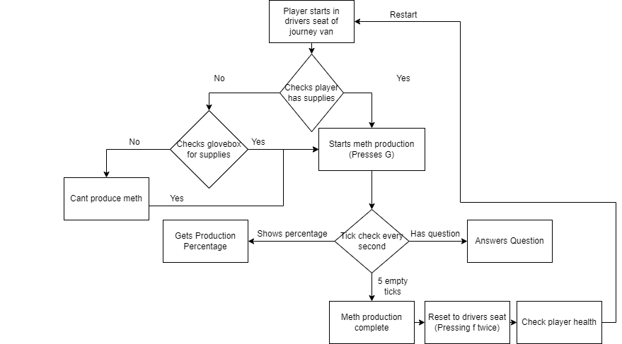

# NSRP Automation
Automate the production of meth in GTA NSRP.

### Features:
- Completely Automates Production (Until supplies run out)
- Maintains Health (Until food or water runs out).

    
*Some steps are not implemented (Check issues)*


### Setup:
#### 1. Clone Repo:
Either clone or download project
```
git clone https://github.com/HarryLudemann/NSRPAutoMeth
```

#### 2. Install Required Modules:
Move into downloaded 'NSRPAutoMeth' folder in terminal:
```
cd NSRPAutoMeth
pip install -r requirements.txt
```

#### 3. Check Settings:
Check that all settings are appropriate within settings.ini

#### 4. Run
Run 'python start.py' script to start the bot:
```
python start.py
```
